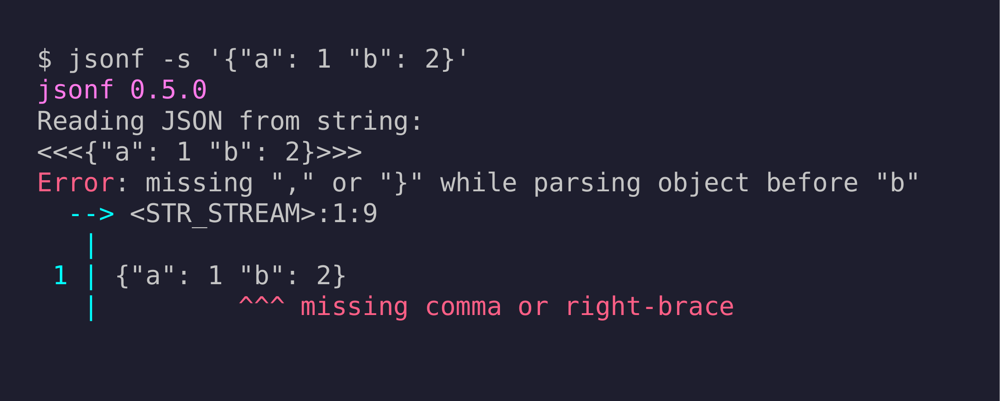
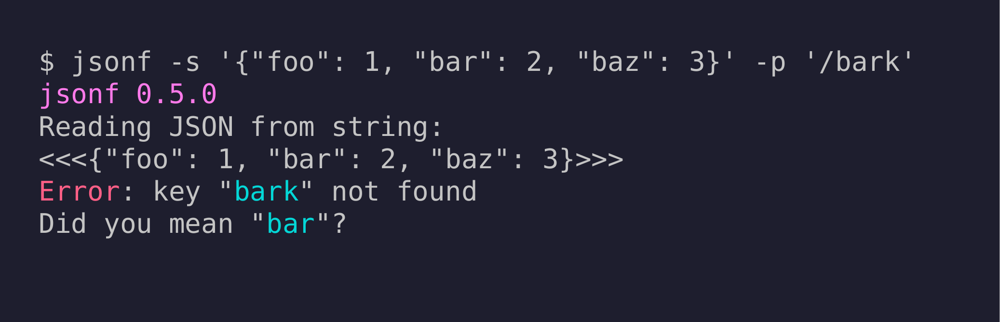
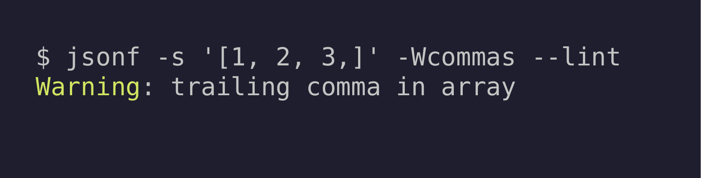

# jsonf

A JSON parser and formatter in Fortran.

[](https://github.com/jeffirwin/jsonf/actions/workflows/main.yml)

## Why another Fortran json parser?

There's no good reason -- for an alternative I recommend [json-fortran](https://github.com/jacobwilliams/json-fortran/wiki/Example-Usage)

## Features

- Pretty-print and compact output formatting
- Read JSON from a file or inline string
- Query values with [RFC 6901 JSON pointer](https://datatracker.ietf.org/doc/html/rfc6901) paths
- Spell-check on bad keys — suggests the closest match
- Rust-style error messages with source location and `^`-underlines
- Lint mode: validate without printing output
- Warnings and errors for trailing commas (`-Wcommas`) and non-standard number formats (`-Wnumbers`)
- Duplicate key control: keep last (default), keep first, or disallow
- Library API with typed scalar, vector, and matrix getters



## Install

Use [fpm](https://fpm.fortran-lang.org/), the Fortran package manager:

```bash
fpm install
```

The `jsonf` binary is installed to the default fpm path, usually `~/.local/bin`.

## CLI Usage

```
jsonf 0.5.0
 Usage:
     jsonf -h | --help
     jsonf FILE.json [(-p|--pointer) POINTER]
     jsonf (-s|--string) STRING [(-p|--pointer) POINTER]
     jsonf [-c | --compact]
     jsonf [-d | --no-dup]
     jsonf [-f | --first-dup]
     jsonf [-l | --lint]
     jsonf [-q | --quiet]
     jsonf [-t | --tokens]
     jsonf --version
     jsonf [-Wno-commas | -Wcommas | -Werror=commas]
     jsonf [-Wnumbers | -Werror=numbers]

 Options:
     --help            Show this help
     FILE.json         Input json filename
     --string          Input json string
     --pointer         json pointer path
     --lint            Check json for syntax errors
     --compact         Format compactly without whitespace
     --first-dup       Keep first duplicate key, default last
     --no-dup          Do not allow duplicate keys
     --quiet           Decrease log verbosity
     --tokens          Dump tokens without parsing json
     --version         Show the jsonf version number
     -Wno-commas       Suppress trailing-comma warnings in --lint
     -Wcommas          Warn about trailing commas
     -Werror=commas    Treat trailing commas as errors
     -Wnumbers         Warn for bad number formats like '.0' or '1.d2'
     -Werror=numbers   Treat bad number formats as errors
```

### File and string input

```bash
jsonf data.json
jsonf --string '{"a": 1, "b": 2}'
jsonf -s '{"a": 1, "b": 2}'
```

### JSON pointer queries

Use [RFC 6901](https://datatracker.ietf.org/doc/html/rfc6901) pointer syntax with `--pointer` / `-p`:

```bash
jsonf -s '{"a": 1, "b": 2}' -p '/a'
# 1

jsonf -s '{"foo": 3, "bar": {"a": 1, "b": 2}}' -p '/bar/b'
# 2

jsonf -s '{"baz": [0, 10, 20, 30]}' -p '/baz/3'
# 30
```

### Spell-check on bad keys

```bash
jsonf -s '{"foo": 1, "bar": 2, "baz": 3}' -p '/bark'
```



### Compact output

```bash
jsonf -s '{"a": 1, "b": [2, 3]}' --compact
# {"a":1,"b":[2,3]}
```

### Linting

```bash
jsonf --lint data.json
# exits 0 on success, prints errors and exits non-zero on failure
```

### Duplicate key handling

```bash
# Default: keep last occurrence
jsonf -s '{"a": 1, "a": 2}'
# {"a": 2}

# Keep first occurrence
jsonf -s '{"a": 1, "a": 2}' --first-dup
# {"a": 1}

# Disallow duplicates (error)
jsonf -s '{"a": 1, "a": 2}' --no-dup
```

### Warning and error flags

```bash
# Warn about trailing commas (e.g. [1, 2,])
jsonf --lint -Wcommas data.json

# Treat trailing commas as errors
jsonf --lint -Werror=commas data.json

# Warn about non-standard number formats like .5 or 1.d2
jsonf --lint -Wnumbers data.json
```

```bash
jsonf -s '[1, 2, 3,]' -Wcommas --lint
```



## Library API

Add `jsonf` as a dependency in your `fpm.toml`:

```toml
[dependencies]
jsonf = { git = "https://github.com/jeffirwin/jsonf" }
```

Then `use jsonf` to access the `json_t` type.

### Reading JSON

```fortran
type(json_t) :: j

call j%read_file('data.json')
! or:
call j%read_str('{"a": 1, "b": [2, 3]}')

if (.not. j%is_ok) then
    call j%print_errors()
    stop 1
end if
```

### Querying values

| Method | Returns | Notes |
|--------|---------|-------|
| `j%get_i64('/path' [, found])` | `integer(8)` | auto-converts from f64 |
| `j%get_f64('/path' [, found])` | `real(8)` | auto-converts from i64 |
| `j%get_str('/path' [, found])` | `character(:), allocatable` | |
| `j%get_bool('/path' [, found])` | `logical` | |
| `j%get_vec_i64('/path' [, found])` | `integer(8), allocatable(:)` | homogeneous array |
| `j%get_vec_f64('/path' [, found])` | `real(8), allocatable(:)` | homogeneous array |
| `j%get_vec_bool('/path' [, found])` | `logical, allocatable(:)` | homogeneous array |
| `j%get_vec_str('/path' [, found])` | `type(str_t), allocatable(:)` | avoids uniform-length constraint |
| `j%get_mat_i64('/path' [, found])` | `integer(8), allocatable(:,:)` | shape `(nrows, ncols)` |
| `j%get_mat_f64('/path' [, found])` | `real(8), allocatable(:,:)` | shape `(nrows, ncols)` |
| `j%get('/path' [, found])` | `type(json_val_t)` | generic subtree |

The optional `found` (`logical`) argument suppresses errors when a path is absent.

### Metadata

| Method | Returns | Notes |
|--------|---------|-------|
| `j%has('/path')` | `logical` | true if path exists |
| `j%is_null('/path')` | `logical` | true if value is JSON null |
| `j%len('/path')` | `integer` | number of elements in array or object |

### Output

| Method | Description |
|--------|-------------|
| `j%print()` | Pretty-print to stdout |
| `j%to_str()` | Return formatted JSON as a string |
| `j%write(unit)` | Write to a Fortran unit |

### Configuration

Set fields on `json_t` before reading:

```fortran
j%compact               = .true.  ! compact output
j%error_duplicate_keys  = .true.  ! disallow duplicate keys
j%first_duplicate       = .true.  ! keep first duplicate (default: last)
j%warn_trailing_commas  = .true.  ! warn on trailing commas
j%error_trailing_commas = .true.  ! error on trailing commas
j%warn_numbers          = .true.  ! warn on non-standard number formats
j%error_numbers         = .true.  ! error on non-standard number formats
j%print_errors_immediately = .false.  ! accumulate; call j%print_errors() later
j%lint                  = .true.  ! lint mode (skip object/array storage)
```

### Example

```fortran
program example
    use jsonf
    implicit none

    type(json_t) :: j
    integer(kind=8) :: age, val
    real(kind=8), allocatable :: scores(:)
    logical :: found

    call j%read_str('{"name": "Alice", "age": 30, "scores": [95.0, 87.0, 92.0]}')
    if (.not. j%is_ok) then
        call j%print_errors()
        stop 1
    end if

    age = j%get_i64('/age')
    print *, 'age:', age           ! 30

    scores = j%get_vec_f64('/scores')
    print *, 'scores:', scores     ! 95.0 87.0 92.0

    val = j%get_i64('/missing', found)
    if (.not. found) print *, 'key not found'
end program example
```

## Building from source

```bash
fpm build                    # debug build
fpm build --profile release  # release build
fpm test                     # run all tests
```

CI runs in Docker (`docker build . -t rocky`) and tests debug, release, and various CLI flags.

## License

BSD 3-Clause. See [LICENSE](LICENSE).
